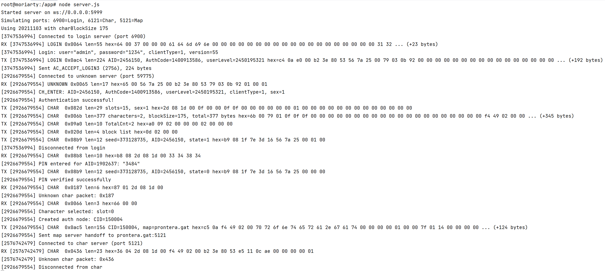

# Netuno - A OpenSource Mock server for roBrowser Legacy

> [!CAUTION]
> This is an alpha-early-stage proof of concept. This IS broken and it HAS bugs. 

This project is just a dummy server that emulates the responses from a rAthena server to be used with roBrowserLegacy.
This allows us to do some automated testing without spinning up a real rAthena server and its infrastructure.

## How to use it

> [!WARNING]  
> This is hardcoded to work on 127.0.0.1 (localhost) environments.
> Check if the port 5999 is free on the host.

> [!WARNING]  
> The only tested configuration is PACKET_VER 20211103, charBlockSize 175 (renewal)

### Docker

Run the following command on the same network/host were roBrowser is running:

```bash
docker build -t netuno . -f Dockerfile 
docker run -it --network=host -v ./:/app netuno /bin/bash
```

Inside the container shell, run the node commands needed:

Install dependencies:
```bash
npm install
```

Run the server:
```
node server.js
```

### Configure your roBrowser

> [!WARNING]  
> Do not copy/paste this, make sure you read and modify only the needed parameters.

This is the relevant configuration block for the roBrowser server configuration:

```javascript
window.ROConfig = {
    servers: [{
        address: '127.0.0.1',
        port: 6900,
        version: 55,
        langtype: 1,
        packetver: 20211103,
        renewal: true,
        packetKeys: false,
        socketProxy: 'ws://127.0.0.1:5999',
        adminList: [2000000]
    }],
    webserverAdress: '127.0.0.1',
}
```

Compile roBrowserLegacy and test. Any username and password should work, any pin should work, and the returned character
list is on the [helpers.js](./helpers.js#L36) function. 

Example output expected on server terminal:

